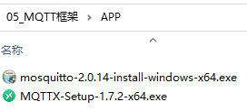
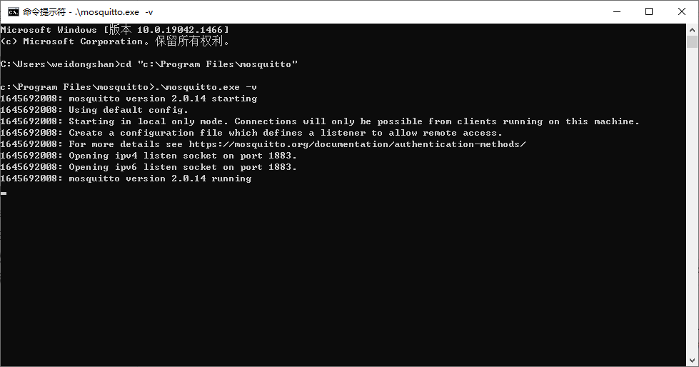
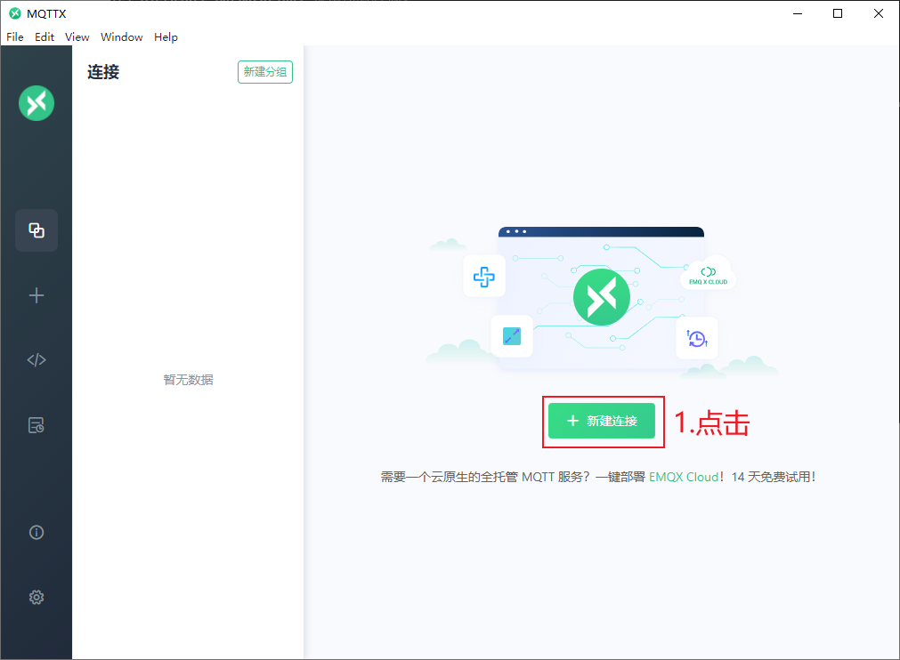
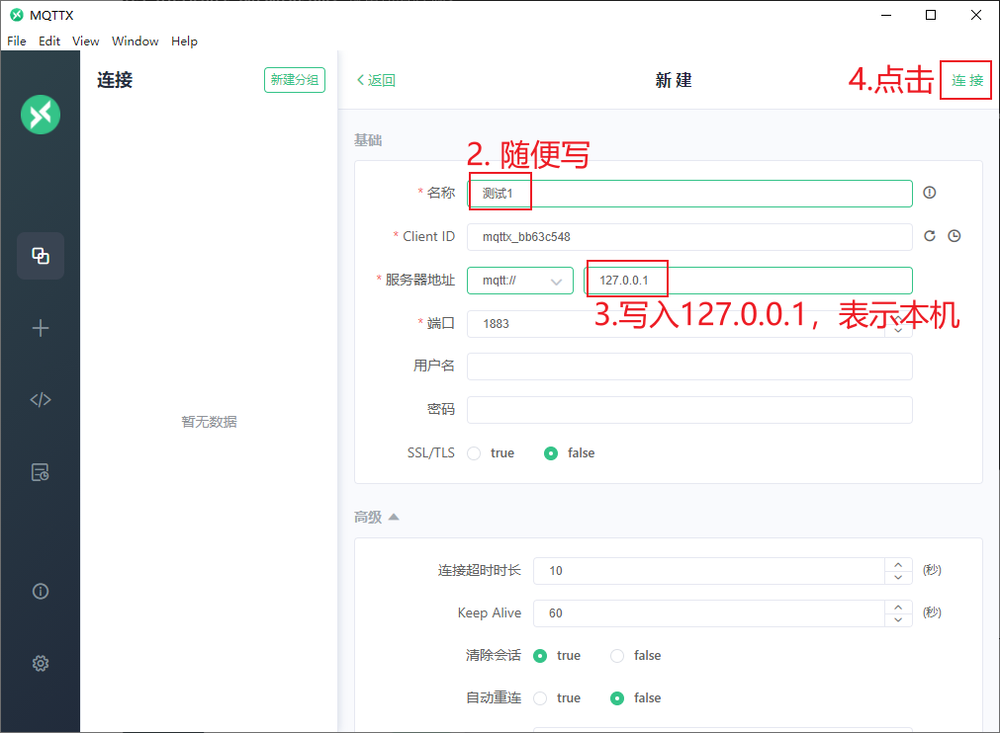
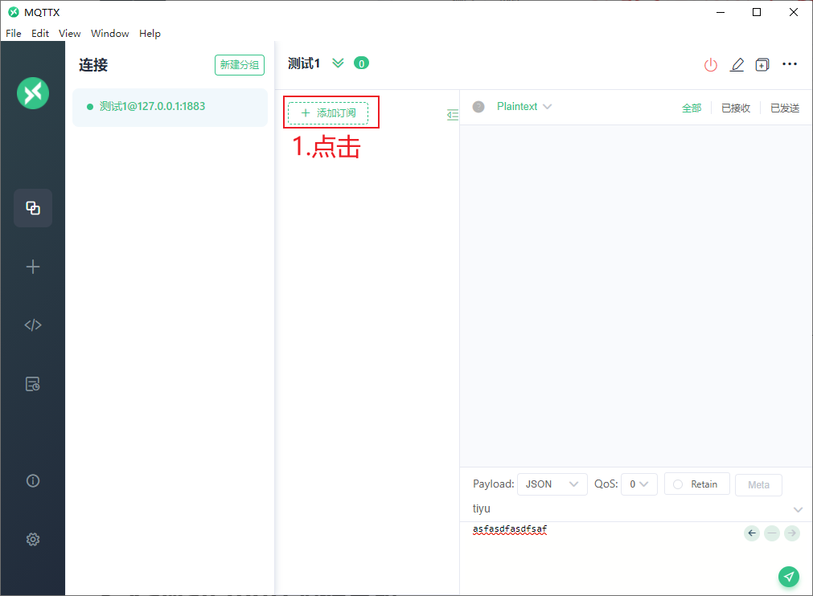
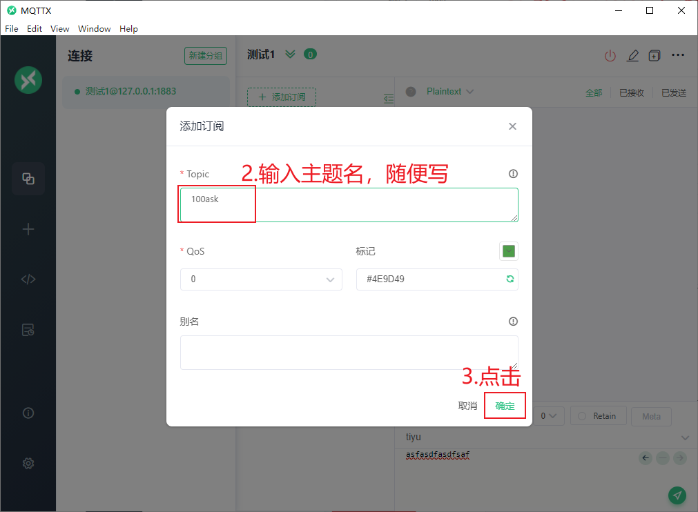
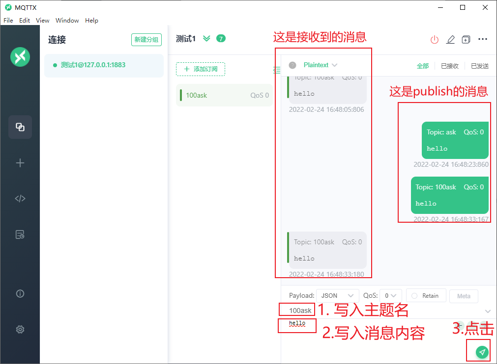
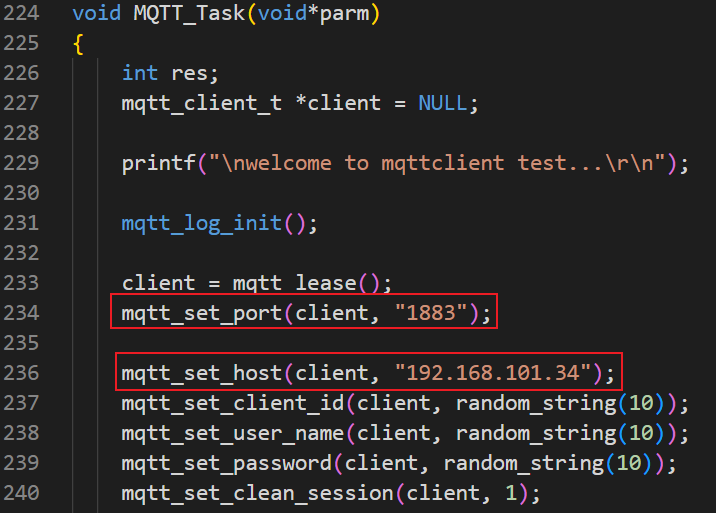

## 在板子和Windows上配置MQTT

### 1.1 安装APP

安装这2个APP：



### 1.2 启动服务器

在PC上启动MQTT Broker：使用DOS命令行，进入mosquitto-2.0.14-install-windows-x64的安装目录

* 修改配置文件mosquitto.conf，如下修改：

  ```shell
  # listener port-number [ip address/host name/unix socket path]
  listener 1883

  allow_anonymous true
  ```
* 启动MQTT Broker：

```shell
cd  "c:\Program Files\mosquitto"
.\mosquitto.exe -c mosquitto.conf -v
```



在下面的实验中，无论是使用MQTTX还是使用mosquitto_pub/mosquitto_sub，都要保持mosquitto.exe在运行。

### 1.3 使用MQTTX

#### 1.3.1 建立连接

运行MQTTX后，如下图操作：





#### 1.3.2 订阅主题

建立连接后，如下图操作：





#### 1.3.3 发布主题

如下操作：



### 1.4开发板连接服务器

·修改main.c中的IP和端口（端口固定1883，IP为创建服务器的电脑IP地址）



开发板连接串口可看到串口打印成功信息
