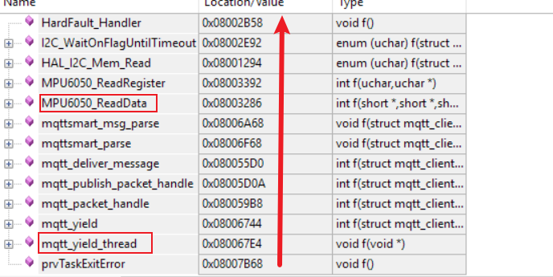
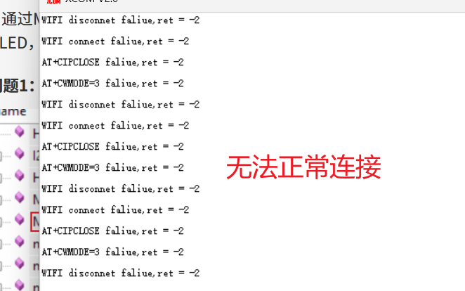
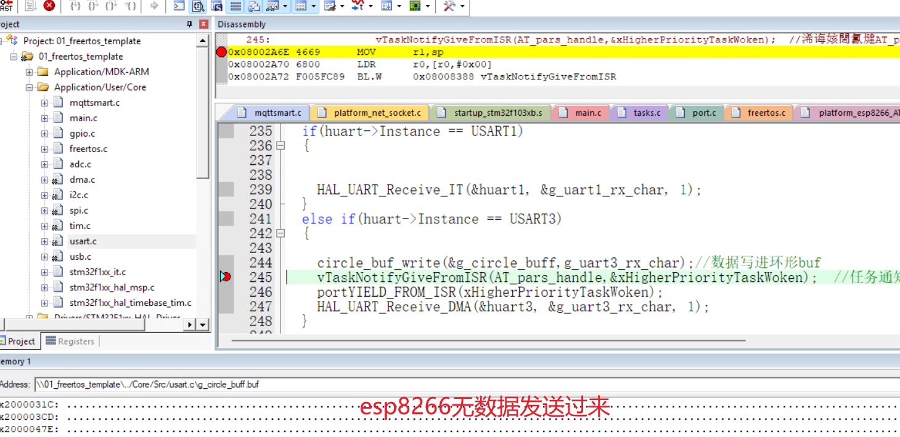
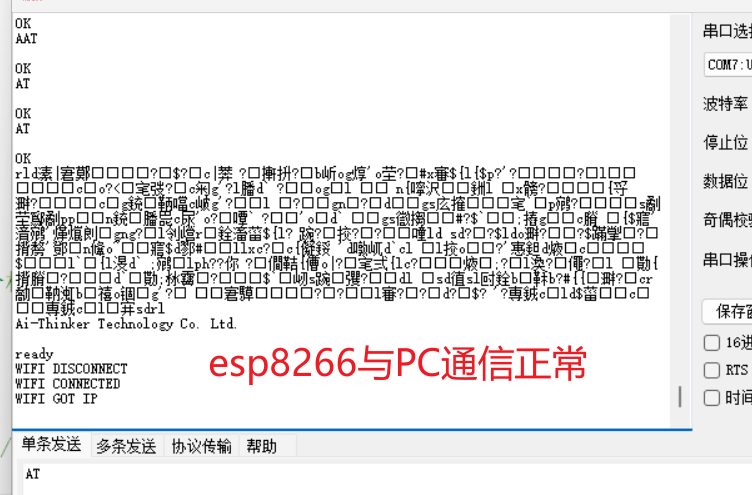
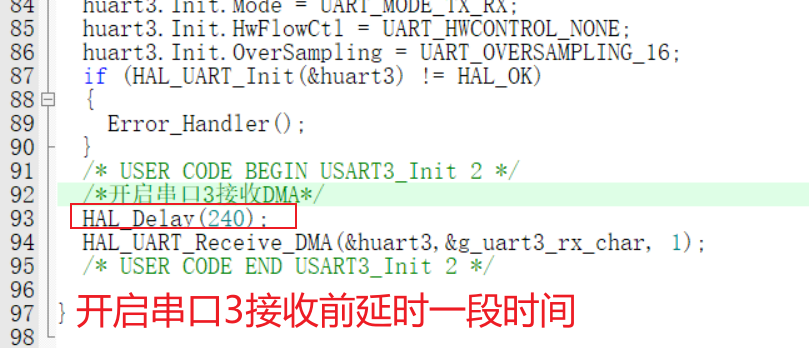

## MQTT移植OK

### 问题1.发数据包时频繁出现错误(发AT命令"AT+CIPSEND="发生错误)

###### 解决：

将二值信号量初始化为0

    

###### 原因查找：

初始mutex为1时第一次发送完AT命令后没有等待线程AT_Parse()解析就直接放回结果，让后面在esp8266处理耗时的AT命令时在esp8266还没处理完就又收到新的AT命令(导致busy p )

### 问题2.连接服务器函数：mqtt_connect_with_results()函数里（mqtt_connect()函数中，在连接TCP服务器等接收CONNACK包时）mqtt_wait_packet()始终返回MQTT_CONNECT_FAILED_ERROR

###### 解决：

###### 原因查找：

原来代码：

底层处理接收数据函数：

1.代码逻辑错误，原来逻辑是寻找到‘，’停止，但i已被设为0，所以原先数据被覆盖。

2.对环形缓冲区理解不到位，直接将esp8266接收数据的数据存入g_AT_process_data_buff环形buff而不是写入，则它的写和读不匹配，g_AT_process_data_buff只被读没被写就一直读不了g_AT_process_data_buff，使得AT_Recv_data一直超时

### 问题3：对于收到订阅的主题发来的消息未能及时处理

###### 原因查找：

函数调用关系如图：

在mqtt_yield()中发现有关时间延迟的函数：

发现该函数mqtt_sleep_ms()实际是延时秒单位

###### 解决：

## 添加应用层功能

功能：

    通过MQTT电脑（手机）客户端发消息能让各类器件进行工作或传递信息回来（器件：OLED，MPU6050，DHT11，彩灯(彩灯G灯与舵机冲突)，led，蜂鸣器，舵机SG90）

### 问题1：偶发读mpu6050数据时死机

### 问题2：掉电再上电后程序无法正常运行

###### 原因查找：

同时给esp8266和单片机上电，或者esp8266先或者后上电，都会出现esp8266完全不发数据的情况，然后再让单片机复位就又有数据发来了

未找到合理解释，现只能进行排除推测：

1.并非单片机硬件问题（换用了两个来测也是存在这个问题）

2.软件本身存在问题，串口3开启接收没延时的话就一直无法收到esp8266信息

###### 解决：

实测最短延时240ms能成功（230ms不行），将单片机和esp8266接入统一电源开关测试20次都能成功（建立TCP服务器连接需要5s左右）

数据如下：

welcome to mqttclient test...[2026-04-21 06:19:06.346]
[2026-04-21 06:19:06.353]
AT+CIPCLOSE faliue,ret = -1[2026-04-21 06:19:06.353]

welcome to mqttclient test...[2026-04-21 06:26:17.598]
[2026-04-21 06:26:17.608]
AT+CIPCLOSE faliue,ret = -1[2026-04-21 06:26:17.608]
mqtt-client:1045 mqtt_connect_with_results() - mqtt connect success[2026-04-21 06:26:21.663]

welcome to mqttclient test...[2026-04-21 06:26:49.464]
[2026-04-21 06:26:49.476]
AT+CIPCLOSE faliue,ret = -1[2026-04-21 06:26:49.476]
mqtt-client:1045 mqtt_connect_with_results() - mqtt connect success[2026-04-21 06:26:55.520]

welcome to mqttclient test...[2026-04-21 06:27:01.103]
[2026-04-21 06:27:01.115]
AT+CIPCLOSE faliue,ret = -1[2026-04-21 06:27:01.115]
mqtt-client:1045 mqtt_connect_with_results() - mqtt connect success[2026-04-21 06:27:07.159]

welcome to mqttclient test...[2026-04-21 06:27:14.784]
[2026-04-21 06:27:14.795]
AT+CIPCLOSE faliue,ret = -1[2026-04-21 06:27:14.795]
mqtt-client:1045 mqtt_connect_with_results() - mqtt connect success[2026-04-21 06:27:19.842]

welcome to mqttclient test...[2026-04-21 06:27:28.421]
[2026-04-21 06:27:28.432]
AT+CIPCLOSE faliue,ret = -1[2026-04-21 06:27:28.432]
mqtt-client:1045 mqtt_connect_with_results() - mqtt connect success[2026-04-21 06:27:33.475]

?
welcome to mqttclient test...[2026-04-21 06:27:45.722]
[2026-04-21 06:27:45.732]
AT+CIPCLOSE faliue,ret = -1[2026-04-21 06:27:45.732]
mqtt-client:1045 mqtt_connect_with_results() - mqtt connect success[2026-04-21 06:27:51.784]

welcome to mqttclient test...[2026-04-21 06:28:07.184]
[2026-04-21 06:28:07.195]
AT+CIPCLOSE faliue,ret = -1[2026-04-21 06:28:07.195]
mqtt-client:1045 mqtt_connect_with_results() - mqtt connect success[2026-04-21 06:28:13.243]

welcome to mqttclient test...[2026-04-21 06:28:29.808]
[2026-04-21 06:28:29.820]
AT+CIPCLOSE faliue,ret = -1[2026-04-21 06:28:29.820]
mqtt-client:1045 mqtt_connect_with_results() - mqtt connect success[2026-04-21 06:28:35.861]

welcome to mqttclient test...[2026-04-21 06:28:48.482]
[2026-04-21 06:28:48.494]
AT+CIPCLOSE faliue,ret = -1[2026-04-21 06:28:48.494]
mqtt-client:1045 mqtt_connect_with_results() - mqtt connect success[2026-04-21 06:28:54.539]

welcome to mqttclient test...[2026-04-21 06:29:02.946]
[2026-04-21 06:29:02.957]
AT+CIPCLOSE faliue,ret = -1[2026-04-21 06:29:02.957]
mqtt-client:1045 mqtt_connect_with_results() - mqtt connect success[2026-04-21 06:29:09.014]

welcome to mqttclient test...[2026-04-21 06:29:20.905]
[2026-04-21 06:29:20.917]
AT+CIPCLOSE faliue,ret = -1[2026-04-21 06:29:20.917]
mqtt-client:1045 mqtt_connect_with_results() - mqtt connect success[2026-04-21 06:29:25.966]

welcome to mqttclient test...[2026-04-21 06:29:46.814]
[2026-04-21 06:29:46.825]
AT+CIPCLOSE faliue,ret = -1[2026-04-21 06:29:46.825]
mqtt-client:1045 mqtt_connect_with_results() - mqtt connect success[2026-04-21 06:29:52.886]

welcome to mqttclient test...[2026-04-21 06:30:25.349]
[2026-04-21 06:30:25.360]
AT+CIPCLOSE faliue,ret = -1[2026-04-21 06:30:25.360]
mqtt-client:1045 mqtt_connect_with_results() - mqtt connect success[2026-04-21 06:30:31.404]

welcome to mqttclient test...[2026-04-21 06:30:51.052]
[2026-04-21 06:30:51.063]
AT+CIPCLOSE faliue,ret = -1[2026-04-21 06:30:51.063]
mqtt-client:1045 mqtt_connect_with_results() - mqtt connect success[2026-04-21 06:30:57.110]

welcome to mqttclient test...[2026-04-21 06:32:05.642]
[2026-04-21 06:32:05.655]
AT+CIPCLOSE faliue,ret = -1[2026-04-21 06:32:05.655]
mqtt-client:1045 mqtt_connect_with_results() - mqtt connect success[2026-04-21 06:32:11.697]

welcome to mqttclient test...[2026-04-21 06:32:21.242]
[2026-04-21 06:32:21.253]
AT+CIPCLOSE faliue,ret = -1[2026-04-21 06:32:21.253]
mqtt-client:1045 mqtt_connect_with_results() - mqtt connect success[2026-04-21 06:32:27.300]

welcome to mqttclient test...[2026-04-21 06:32:33.597]
[2026-04-21 06:32:33.607]
AT+CIPCLOSE faliue,ret = -1[2026-04-21 06:32:33.607]
mqtt-client:1045 mqtt_connect_with_results() - mqtt connect success[2026-04-21 06:32:39.653]

## 优化底层串口代码

修改：将串口3（esp8266）接收中断改成DMA接收（DMA通常在波特率高于115200的场合使用，用于传输大量数据）
