## MQTT移植OK

### 问题1.发数据包时频繁出现错误(发AT命令"AT+CIPSEND="发生错误)

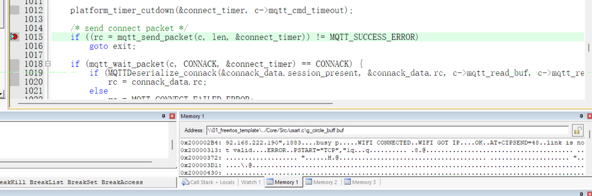

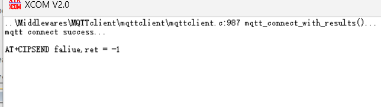

###### 解决：

将二值信号量初始化为0

    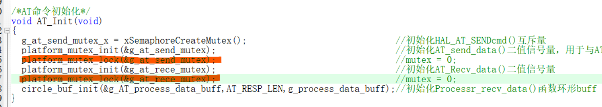

###### 原因分析：

初始mutex为1时第一次发送完AT命令后没有等待线程AT_Parse()解析就直接放回结果，让后面在esp8266处理耗时的AT命令时在esp8266还没处理完就又收到新的AT命令(导致busy p )

### 问题2.mqtt_connect_with_results()函数里（mqtt_connect()函数中，在连接TCP服务器等接收CONNACK包时）mqtt_wait_packet()始终返回MQTT_CONNECT_FAILED_ERROR

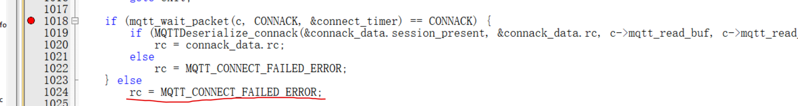

###### 解决：

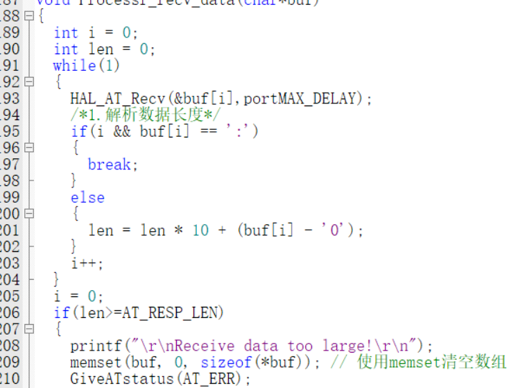

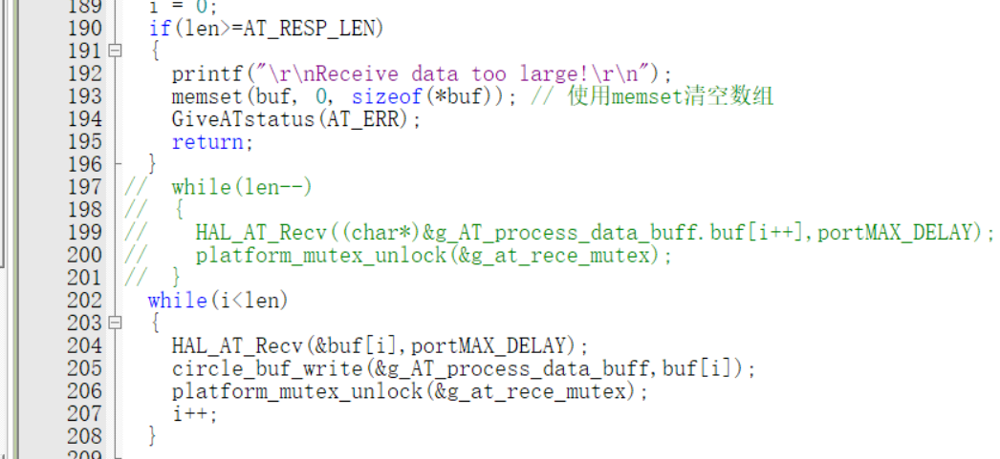

###### 原因分析：

原来代码：

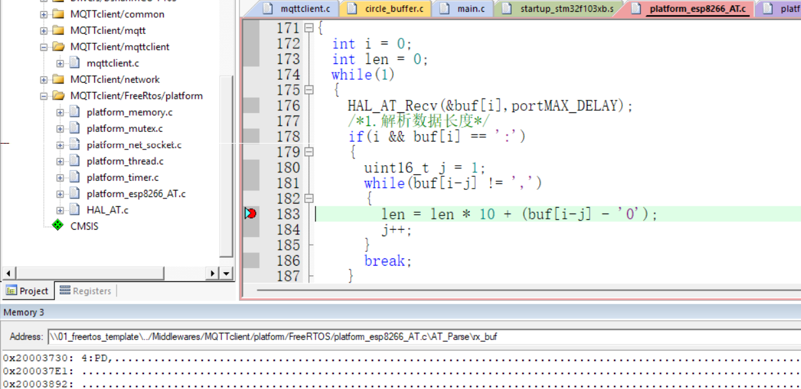

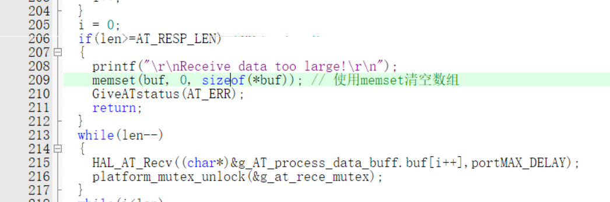

1.代码逻辑错误，原来逻辑是寻找到‘，’停止，但i已被设为0，所以原先数据被覆盖。

2.对环形缓冲区理解不到位，直接将esp8266接收数据的数据存入g_AT_process_data_buff环形buff而不是写入，则它的写和读不匹配，g_AT_process_data_buff只被读没被写就一直读不了g_AT_process_data_buff，使得AT_Recv_data一直超时

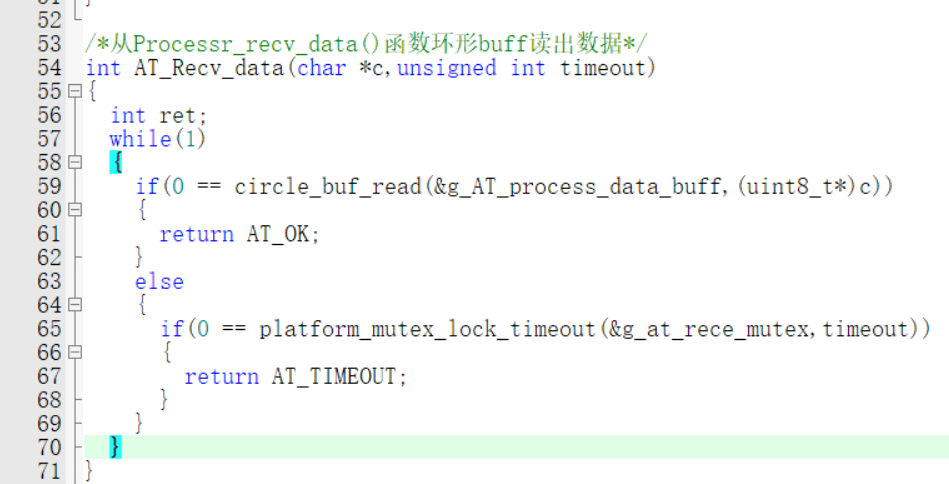

### 问题3：对于收到订阅的主题发来的消息未能及时处理

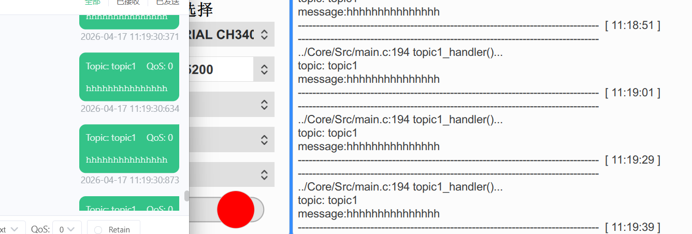

###### 原因分析：

函数调用关系如图：

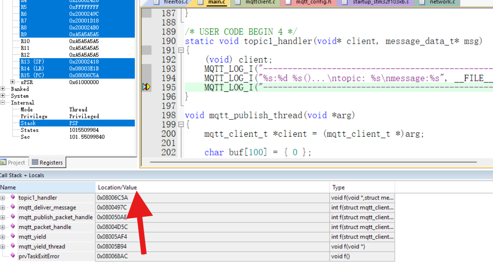

在mqtt_yield()中发现有关时间延迟的函数：

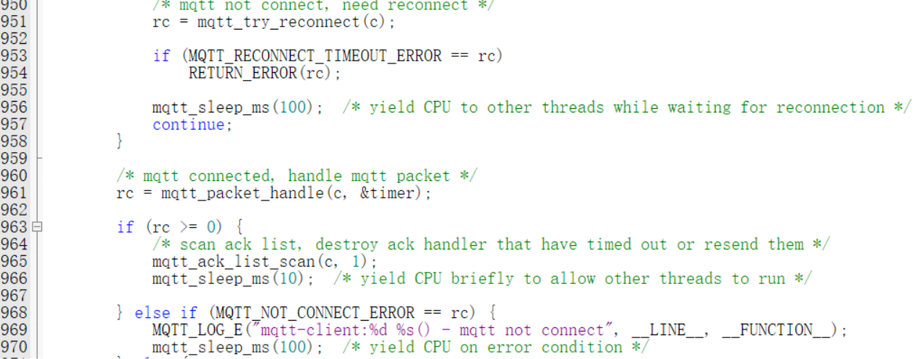

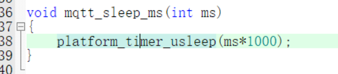

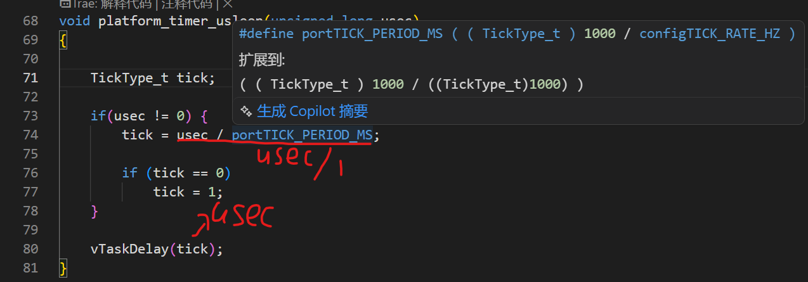

发现该函数mqtt_sleep_ms()实际是延时秒单位

###### 解决：

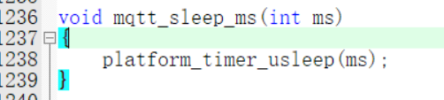

## 添加应用层功能

功能：

    通过MQTT电脑（手机）客户端发消息能让各类器件进行工作或传递信息回来（器件：OLED，MPU6050，DHT11，彩灯(彩灯G灯与舵机冲突)，led，蜂鸣器，舵机SG90）

## 优化底层串口代码

修改：将串口3（esp8266）接收中断改成DMA接收（DMA通常在波特率高于115200的场合使用，用于传输大量数据）
